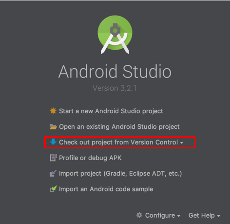

# android basic app template
### Getting started
Clone this project using terminal or open android studio  and click **Check out project from Version Control** 



and paste the url `https://github.com/ajithvgiri/app_template.git` .


##Basic Codes
1. To start an Activity (navigate from one activity to another).
2. To commit a Fragment (commit a fragment from activity).

###1. Start an Activity

**Kotlin**
``` kotlin
startActivity(Intent(this, YourActivity::class.java))
```

**Java**
``` java
startActivity(new Intent(this, YourActivity.class));
```

###2. Commit a Frament
**Kotlin**

``` kotlin
// get fragment manager
        val fm = supportFragmentManager

        // add
        val ft = fm.beginTransaction()
        ft.add(R.id.your_placehodler, YourFragment())
        ft.commit()

        // replace
        val ft = fm.beginTransaction()
        ft.replace(R.id.your_placehodler, YourFragment())
        ft.commit()

        // remove
        val fragment = fm.findFragmentById(R.id.your_placehodler)
        val ft = fm.beginTransaction()
        ft.remove(fragment)
        ft.commit()
```


**Java**
``` java

// get fragment manager
FragmentManager fm = getFragmentManager();

// add
FragmentTransaction ft = fm.beginTransaction();
ft.add(R.id.your_placehodler, new YourFragment());
ft.commit();

// replace
FragmentTransaction ft = fm.beginTransaction();
ft.replace(R.id.your_placehodler, new YourFragment());
ft.commit();

// remove
Fragment fragment = fm.findFragmentById(R.id.your_placehodler);
FragmentTransaction ft = fm.beginTransaction();
ft.remove(fragment);
ft.commit();
```